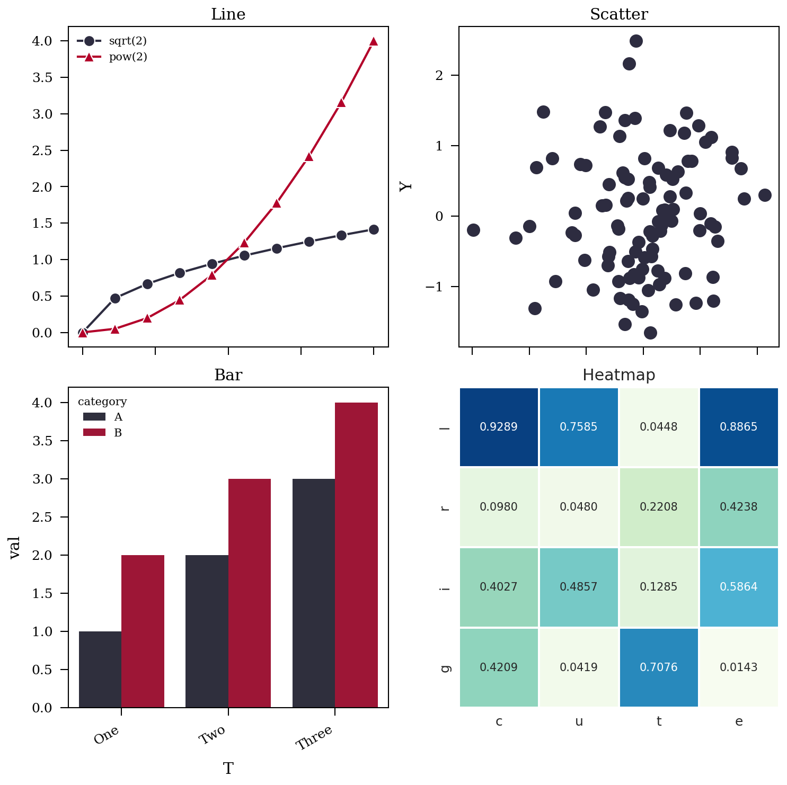
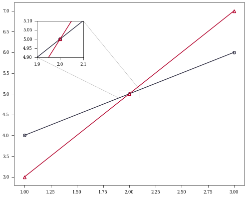

FreePlot is a Python data visualization library based on matplotlib. It provides some simple implements according to my preference. Matplotlib is powerful yet not easy to draw what you want due to its complicated arguments. I feel FreePlot is more friendly, especially for papers.

## Installation

```
pip install freeplot
```

## Quick Recipe


1. import

```
from freeplot.base import FreePlot
```

2. create a new container

```
fp = FreePlot(shape=(2, 2), figsize=(5, 5), titles=('a', 'b', 'c', 'd'), sharey=True)
```
shape: the arrangement of axes, 2 x 2, a total 4 axes in this case;

figsize: (width, height), 500 x 500 in this case;

titles: the title for each ax;

sharey: axes will share the y axis if true.

the container can be used in a ndarray-style, e.g.:
```
# fp[0, 0], fp[0, 1]
```
You can also use title:
```
# fp['a']
```
But the slice operation is not supported:
```
# fp[:, 0]
```

3. plotting

I implement some methods for plotting such as lineplot, scatterplot ...

```
fp.lineplot(x=[1, 2, 3], y=[4, 5, 6], index=(0, 0), label='test')
```

4. set xlabel, ylabel

use
```
fp.set_label('X', axis='x', index=(0, 0))
fp.set_label('Y', axis='y', index=(0, 0))
```
or
```
fp.set(xlabel='X', ylabel='Y', index=(0, 0))
```

5. set title

```
fp.set_title(y=0.98) # for all axes
```

6. save your fig

```
fp.savefig('test.pdf')
```

## Example

### Line, Scatter, Bar, Heatmap

Let's do a little complicate plotting.

```

import numpy as np
import pandas as pd
from freeplot.base import FreePlot


titles = ('Line', 'Scatter', 'Bar', 'Heatmap')
fp = FreePlot(shape=(2, 2), figsize=(5, 5), titles=titles, sharey=False)
fp.set_style('no-latex')

# Line
x = np.linspace(0, 2, 10)
y1 = x ** 0.5
y2 = x ** 2
fp.lineplot(x, y1, index=(0, 0), style='linemarker', label='sqrt(2)')
fp.lineplot(x, y2, index=(0, 0), style='linemarker', label='pow(2)')
fp[0, 0].legend()

# scatter
x = np.random.randn(100)
y = np.random.randn(100)
fp.scatterplot(x, y, index='Scatter', style='scatter')
fp.set_label('X', index=(0, 1), axis='x')
fp.set(ylabel='Y', index=(0, 1))

# bar
A = [1., 2., 3.]
B = [2., 3., 4.]
T = ['One', 'Two', 'Three'] * 2
Hue = ['A'] * len(A) + ['B'] * len(B)

data = pd.DataFrame(
    {
        "T": T,
        "val": A + B,
        "category": Hue
    }
)
fp.barplot(x='T', y='val', hue='category', data=data, index=(1, 0), auto_fmt=True)

# Heatmap
row_labels = ('c', 'u', 't', 'e')
col_labels = ('l', 'r', 'i', 'g')
data = np.random.rand(4, 4)
df = pd.DataFrame(data, index=col_labels, columns=row_labels)
fp.heatmap(df, index='Heatmap', annot=True, fmt=".4f", cbar=False, linewidth=0.5)

# set titles
fp.set_title(y=0.98)

# savefig
fp.savefig('demo.png')
# fp.show()

```





### Radar


```

import numpy as np
from freeplot.base import FreePlot
from freeplot.zoo import pre_radar, pos_radar


labels = (
    "brightness", "fog", "gaussian_blur", "glass_blur", "jpeg_compression",
    "motion_blur", "saturate, snow", "speckle_noise", "contrast", "elastic_transform", "frost",
    "gaussian_noise", "impulse_noise", "pixelate", "shot_noise", "spatter", "zoom_blur", "transform", "flowSong"
)

theta = pre_radar(len(labels), frame="polygon")

# shape: 1, 1; figsize: 4, 4;
fp = FreePlot((1, 1), (4, 4), dpi=100, titles=["RADAR"], projection="radar")
fp.set_style('no-latex')

data = {
    "A": np.random.rand(len(labels)),
    'B': np.random.rand(len(labels)),
    'C': np.random.rand(len(labels))
}

pos_radar(data, labels, fp, index=(0, 0), style='bright')

fp[0, 0].legend()

fp.savefig("radar.png", tight_layout=True)
```


### Violin


```
import numpy as np
import matplotlib.pyplot as plt
from freeplot.base import FreePlot


fp = FreePlot((1, 1), (5, 5))
# note that each element is a group of data ...
all_data = [np.random.normal(0, std, 100) for std in range(5, 10)]
fp.violinplot(x=None, y=all_data, index=(0, 0))

fp.savefig('violin.png')

```


### Inset_axes


```

from freeplot.base import FreePlot


fp = FreePlot((1, 1), (5, 4))

fp.lineplot([1, 2, 3], [4, 5, 6], label='a')
fp.lineplot([1, 2, 3], [3, 5, 7], label='b')
axins, patch, lines = fp.inset_axes(
    xlims=(1.9, 2.1),
    ylims=(4.9, 5.1),
    bounds=(0.1, 0.7, 0.2, 0.2),
    index=(0, 0),
    style='line' # !!!
)
fp.lineplot([1, 2, 3], [4, 5, 6], index=axins)
fp.lineplot([1, 2, 3], [3, 5, 7], index=axins)
fp.savefig('inset.png')
```





## Latex


Because we adopt the 'science' as the basic style, which use latex in default, it will raise error if you don't have Latex on you computer. 
In addition, it needs long time to throughly complete the plotting under 'latex' environment.
You shall use the following to close it,
```
fp.set_style('no-latex')
```
or
```
plt.style.use('no-latex')
```


## Tips


1. For lineplot, barplot ..., you can directly use matplotlib.axes._axes.Axes as index, e.g.:

   ```
   fp.lineplot(x, y, index=fp[0, 0])
   ```

2. You may find some interesting implementations in freeplot.zoo, such as tsne, roc_curve ...

3. You can use a list of styles:

    ```
    fp.set_style(['bright', 'high-vis', {"axes.facecolor":".9"}])
    ```
4. It would be better to use

    ```
    fp.legend
    ```
    to set legend instance instead of
    ```
    fp[0, 0].legend
    ```

5. You can find all available styles by
    ```
    fp.styles
    ```
6. You can scale x|y-axis by
    ```
    fp.set_scale(value='symlog', index=(0, 0), axis='x')
    fp.set_scale(value='symlog', index=(0, 0), axis='y')
    ```