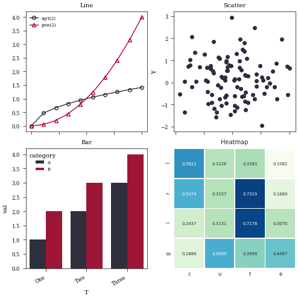

# FreePlot

FreePlot 是一个基于 Matplotlib 的 Python 绘图库, 面向实验图表和论文可视化场景, 提供紧凑的图形容器和常见绘图封装。

## 核心特性

- 网格化图形容器, 支持按标题或索引访问 Axes
- 封装折线图、散点图、柱状图、热力图、小提琴图、雷达图、局部放大图和 3D 曲面图
- 保留 Matplotlib Axes 的底层定制能力
- 示例沉淀在文档中, 支持无 GUI 环境运行

## 安装

FreePlot 要求 Python 3.9 或更新版本。

```bash
pip install freeplot
```

本地开发安装:

```bash
pip install -e ".[dev,docs]"
```

## 快速开始

```python
import matplotlib

matplotlib.use("Agg")

import numpy as np

from freeplot import FreePlot

x = np.linspace(0, 2, 20)
y = x**2

fp = FreePlot(shape=(1, 1), figsize=(2.4, 3.2), dpi=160)
fp.lineplot(x, y, label="x^2", marker="")
fp.set(xlabel="x", ylabel="y")
fp[0, 0].legend()
fp.savefig("quickstart.png")
```

## 文档

文档位于 [`docs/`](docs/index.rst)。本地构建:

```bash
sphinx-build -b html docs docs/_build/html
```

## 预览



## 许可证

FreePlot 使用 MIT License。
