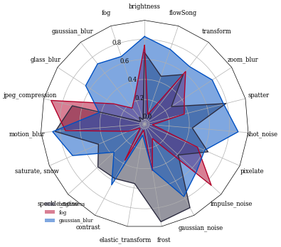

FreePlot 是一个用于可视化的Python库, 其实现基于matplotlib. 其中根据个人的喜好实现了一些画图方法. Matplotlib是一个功能非常强大的库, 但是由于其复杂的参数导致很难上手. 个人感觉FreePlot是非常友好的, 特别是用于写论文.

## 安装

```
pip install freeplot
```

## 速览

1. 引入freeplot

   ```
   from freeplot.base import FreePlot
   ```

2. 创建一个容器

   ```
   fp = FreePlot(shape=(2, 2), figsize=(5, 5), titles=('a', 'b', 'c', 'd'), sharey=True)
   ```

   shape: 表明容器中axes的配置, 在此例中, 为 2 x 2共4个axes;

   figsize: (width, height), 用于指定图片的宽高, 此例为500 x 500;

   titles: 为每个ax指定标题;

   sharey: axes之间是否共享y轴.

   容器可以通过类ndarray的方式获取ax:

   ```
   # fp[0, 0], fp[0, 1]
   ```

   你也可以使用标题:

   ```
   # fp['a']
   ```

   但是需要注意的是, 切片操作是不被支持的:

   ```
   # fp[:, 0]
   ```

3.  画图

   我实现了一些画图方法, 如 lineplot, scatterplot等:

   ```
   fp.lineplot(x=[1, 2, 3], y=[4, 5, 6], index=(0, 0), label='test')
   ```

4.  设定 xlabel, ylabel:

   可以通过

   ```
   fp.set_label('X', axis='x', index=(0, 0))
   fp.set_label('Y', axis='y', index=(0, 0))
   ```

   或者

   ```
   fp.set(xlabel='X', ylabel='Y', index=(0, 0))
   ```

5. 设定标题

   ```
   fp.set_title(y=0.98) # 对于所有axes均生效
   ```

6. 保存图片

   ```
   fp.savefig('test.pdf')
   ```


## 例子


### Line, Scatter, Bar, Heatmap

Let's do a little complicate plotting.

```
import numpy as np
import pandas as pd
from freeplot.base import FreePlot


titles = ('Line', 'Scatter', 'Bar', 'Heatmap')
fp = FreePlot(shape=(2, 2), figsize=(5, 5), titles=titles, sharey=False)
fp.set_style('no-latex')

# Line
x = np.linspace(0, 2, 10)
y1 = x ** 0.5
y2 = x ** 2
fp.lineplot(x, y1, index=(0, 0), style='line', label='sqrt(2)')
fp.lineplot(x, y2, index=(0, 0), style='line', label='pow(2)')
fp[0, 0].legend()

# scatter
x = np.random.randn(100)
y = np.random.randn(100)
fp.scatterplot(x, y, index='Scatter', style='scatter')
fp.set_label('X', index=(0, 1), axis='x')
fp.set(ylabel='Y', index=(0, 1))

# bar
A = [1., 2., 3.]
B = [2., 3., 4.]
T = ['One', 'Two', 'Three'] * 2
Hue = ['A'] * len(A) + ['B'] * len(B)

data = pd.DataFrame(
    {
        "T": T,
        "val": A + B,
        "category": Hue
    }
)
fp.barplot(x='T', y='val', hue='category', data=data, index=(1, 0), auto_fmt=True)

# Heatmap
row_labels = ('c', 'u', 't', 'e')
col_labels = ('l', 'r', 'i', 'g')
data = np.random.rand(4, 4)
df = pd.DataFrame(data, index=col_labels, columns=row_labels)
fp.heatmap(df, index='Heatmap', annot=True, fmt=".4f", cbar=False, linewidth=0.5)

# set titles
fp.set_title(y=0.98)

# savefig
fp.savefig('demo.png')
# fp.show()

```


### Radar


```
import numpy as np
from freeplot.base import FreePlot
from freeplot.zoo import pre_radar, pos_radar


labels = (
    "brightness", "fog", "gaussian_blur", "glass_blur", "jpeg_compression",
    "motion_blur", "saturate, snow", "speckle_noise", "contrast", "elastic_transform", "frost",
    "gaussian_noise", "impulse_noise", "pixelate", "shot_noise", "spatter", "zoom_blur", "transform", "flowSong"
)

theta = pre_radar(len(labels), frame="polygon")

# shape: 1, 1; figsize: 4, 4;
fp = FreePlot((1, 1), (4, 4), dpi=100, titles=["RADAR"], projection="radar")
fp.set_style('no-latex')

data = {
    "A": np.random.rand(len(labels)),
    'B': np.random.rand(len(labels)),
    'C': np.random.rand(len(labels))
}

pos_radar(data, labels, fp, index=(0, 0), style='bright')

fp[0, 0].legend()

fp.savefig("radar.png", tight_layout=True)
```





### Violin


```
import numpy as np
import matplotlib.pyplot as plt
from freeplot.base import FreePlot


fp = FreePlot((1, 1), (5, 5))
# note that each element is a group of data ...
all_data = [np.random.normal(0, std, 100) for std in range(5, 10)]
fp.violinplot(x=None, y=all_data, index=(0, 0))

fp.savefig('violin.png')

```


### Inset_axes


```
from freeplot.base import FreePlot


fp = FreePlot((1, 1), (5, 4))

fp.lineplot([1, 2, 3], [4, 5, 6], label='a')
fp.lineplot([1, 2, 3], [3, 5, 7], label='b')
axins, patch, lines = fp.inset_axes(
    xlims=(1.9, 2.1),
    ylims=(4.9, 5.1),
    bounds=(0.1, 0.7, 0.2, 0.2),
    index=(0, 0),
    style='line' # !!!
)
fp.lineplot([1, 2, 3], [4, 5, 6], index=axins)
fp.lineplot([1, 2, 3], [3, 5, 7], index=axins)
fp.savefig('inset.png')
```


### 3D Surface

```

import numpy as np
import matplotlib.pyplot as plt
from freeplot.base import FreePlot


X = np.arange(-5, 5, 0.25)
Y = np.arange(-5, 5, 0.25)
X, Y = np.meshgrid(X, Y)
R = np.sqrt(X**2 + Y**2)
Z = np.sin(R)

fp = FreePlot(projection='3d', dpi=300) # projection: '3d' !!!
fp.surfaceplot(X, Y, Z, cmap=plt.cm.coolwarm, antialiased=False, linewidth=0)
fp.set_label(r"$x$", axis='x')
fp.set_label(r"$y$", axis='y')
fp.set_label(r"$z$", axis='z')
fp.show()

```


## Latex的使用


现在创建fp时提供了latex开启的选项(默认关闭):

```
fp = FreePlot(latex=True)
```

使用latex编译会导致画图的时间变长. 可以通过如下的命令令其失效:

```
fp.set_style('no-latex')
```

或者

```
plt.style.use('no-latex')
```


## 小技巧


1. 对于 lineplot, barplot 等方法, 你可以直接传入 matplotlib.axes._axes.Axes 对象作为index, 比如:

   ```
   fp.lineplot(x, y, index=fp[0, 0])
   ```

2. 你在freeplot.zoo 中可能会发现一些你感兴趣的实现, 如 tsne, roc_curve.

3. 你可以一次性使用多个styles:

   ```
   fp.set_style(['bright', 'high-vis', {"axes.facecolor":".9"}])
   ```

4. 使用

   ```
   fp.legend
   ```

   比

   ```
   fp[0, 0].legend
   ```

   在某些时候会更加方便.

5. 通过

   ```
   fp.styles
   ```

   可以得到可用的styles.

6. 你可以调整x, y axis的比例:
    ```
    fp.set_scale(value='symlog', index=(0, 0), axis='x')
    fp.set_scale(value='symlog', index=(0, 0), axis='y')
    ```
    
7. 你可以在axes上添加文字, 如:
    ```
    fp.set_text(x, y, s, fontsize=10)
    ```
    
8. 你可以通过FreePatches来创建简单的几何图形, 并通过下列方式添加:
   ```
   fp.add_patch(patch)
   ```
   
   
