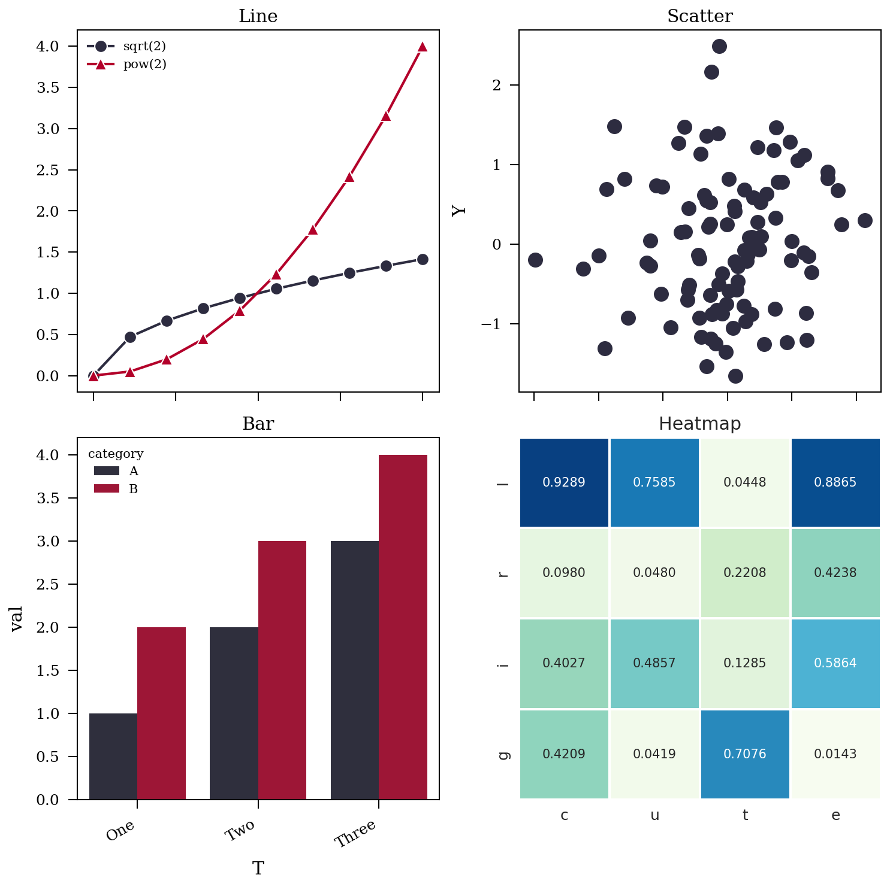

FreePlot
========

FreePlot 是一个基于 Matplotlib 的 Python 绘图库, 面向论文和实验图表场景, 提供更直接的图形容器、样式配置和常见绘图封装。

核心特性
--------

- 基于 Matplotlib, 保留底层 Axes 的可控性。
- 提供网格化图形容器, 支持按位置或标题访问子图。
- 封装折线图、散点图、柱状图、热力图、雷达图、小提琴图和 3D 曲面图等常见图表。
- 面向无 GUI 环境的保存式示例, 便于测试和文档构建。

.. toctree::
   :maxdepth: 2
   :caption: 入门

   installation
   quickstart

.. toctree::
   :maxdepth: 2
   :caption: 教程

   tutorials/index

.. toctree::
   :maxdepth: 2
   :caption: API 参考

   api/index
