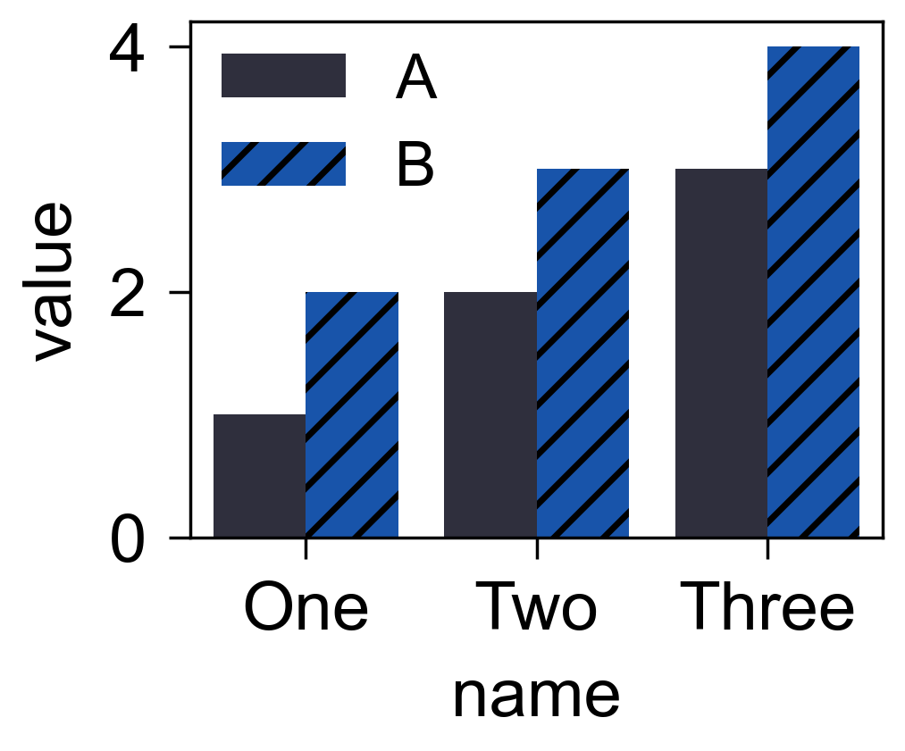

柱状图
======

`barplot` 基于 DataFrame 绘制分组柱状图, 支持 `hue` 和 hatch。

.. code-block:: python

   import pandas as pd
   from freeplot import FreePlot

   data = pd.DataFrame({
       "name": ["One", "Two", "Three"] * 2,
       "value": [1.0, 2.0, 3.0, 2.0, 3.0, 4.0],
       "group": ["A", "A", "A", "B", "B", "B"],
   })

   fp = FreePlot()
   fp.barplot(x="name", y="value", hue="group", data=data, hatch=["", "/"], errorbar=None)
   fp.savefig("bar.png")

