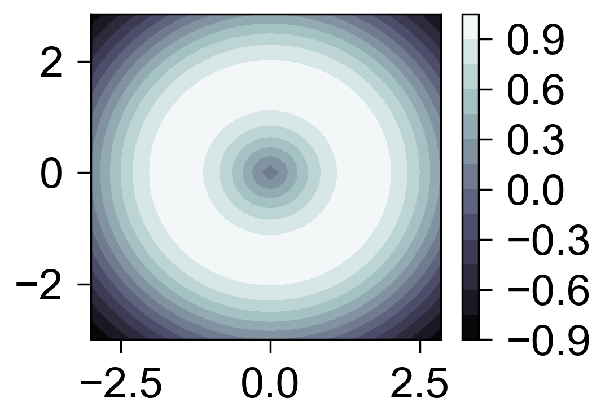

等高面
======

`contourf` 用于绘制填充等高面。

.. code-block:: python

   import numpy as np
   from freeplot import FreePlot

   x = np.arange(-3, 3, 0.15)
   y = np.arange(-3, 3, 0.15)
   X, Y = np.meshgrid(x, y)
   Z = np.sin(np.sqrt(X**2 + Y**2))

   fp = FreePlot()
   fp.contourf(X, Y, Z, levels=12)
   fp.savefig("contour.png")

