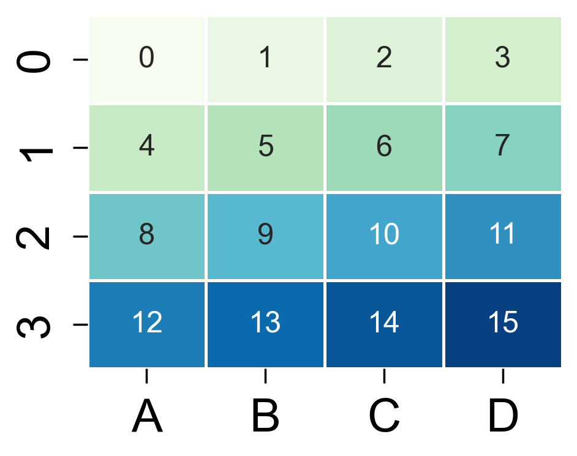

热力图
======

`heatmap` 用于展示矩阵数据。

.. code-block:: python

   import numpy as np
   import pandas as pd
   from freeplot import FreePlot

   data = pd.DataFrame(np.arange(16).reshape(4, 4), columns=list("ABCD"))
   fp = FreePlot()
   fp.heatmap(data, annot=True, fmt=".0f", cbar=False)
   fp.savefig("heatmap.png")

