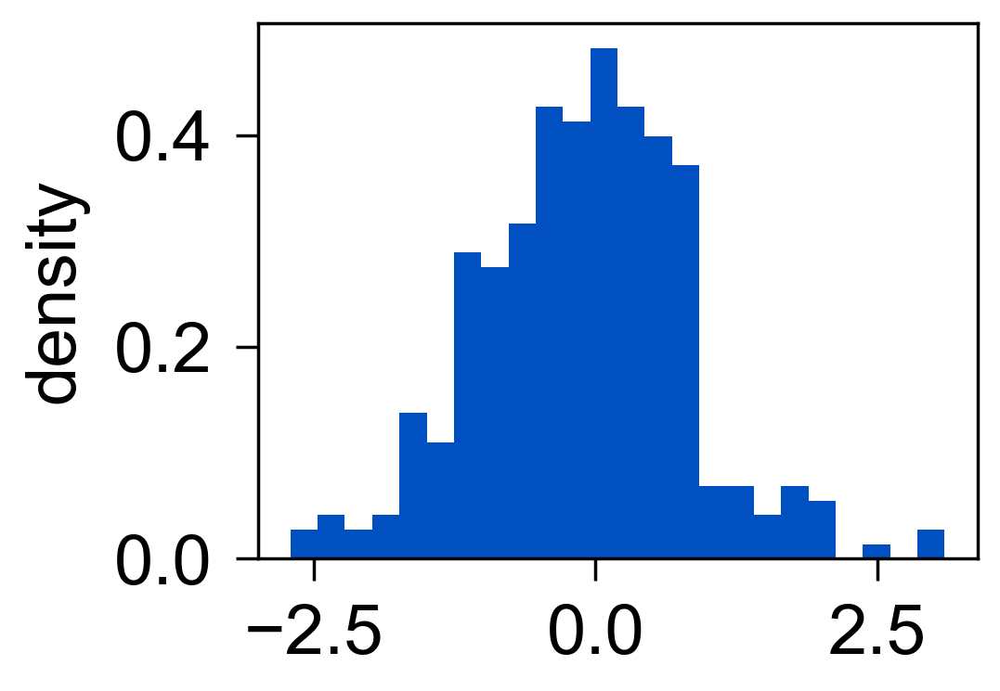

直方图
======

`histplot` 用于展示一维数据分布。

.. code-block:: python

   import numpy as np
   from freeplot import FreePlot

   rng = np.random.default_rng(1)
   fp = FreePlot()
   fp.histplot(rng.normal(size=300), num_bins=24, density=True)
   fp.set_label("density")
   fp.savefig("histogram.png")

