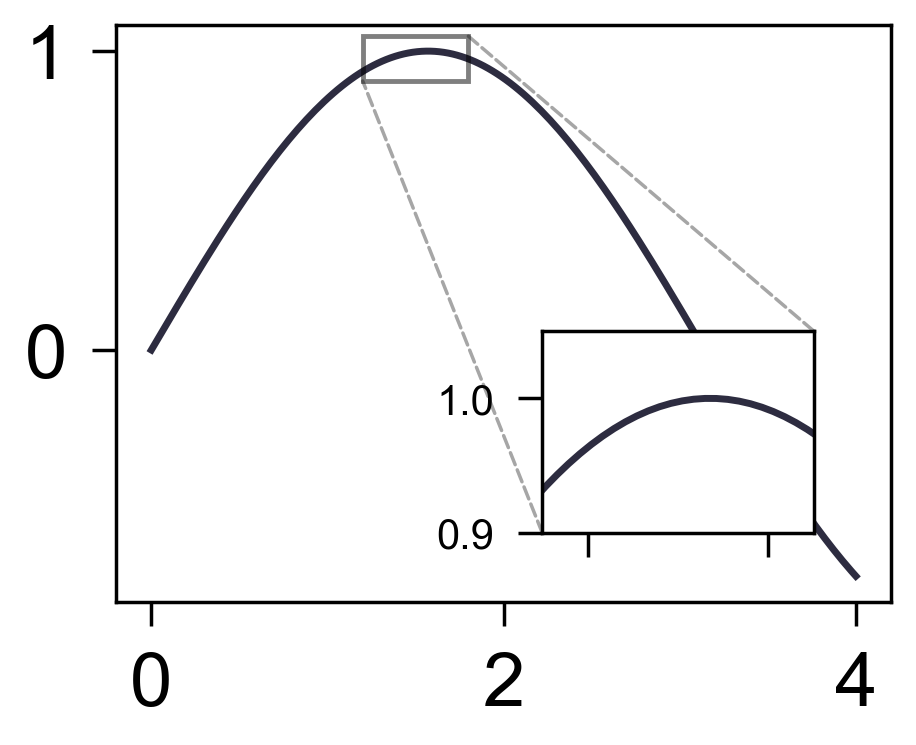

局部放大
========

`inset_axes` 用于在原图中添加局部放大区域。

.. code-block:: python

   import numpy as np
   from freeplot import FreePlot

   x = np.linspace(0, 4, 160)
   y = np.sin(x)

   fp = FreePlot()
   fp.lineplot(x, y, label="sin", marker="")
   axins, patch, lines = fp.inset_axes(
       xlims=(1.2, 1.8),
       ylims=(0.9, 1.05),
       bounds=(0.55, 0.12, 0.35, 0.35),
       style="line",
   )
   fp.lineplot(x, y, index=axins, marker="")
   axins.set_xticks([1.3, 1.7])
   axins.tick_params(labelsize=6, labelbottom=False)
   fp.savefig("inset.png")

