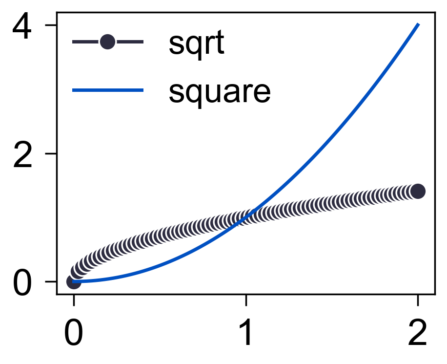

折线图
======

`lineplot` 用于绘制连续趋势, 返回 Matplotlib `Line2D` 对象列表。

.. code-block:: python

   import numpy as np
   from freeplot import FreePlot

   x = np.linspace(0, 2, 80)
   fp = FreePlot()
   fp.lineplot(x, x**0.5, label="sqrt")
   fp.lineplot(x, x**2, label="square", marker="")
   fp[0, 0].legend()
   fp.savefig("line.png")

