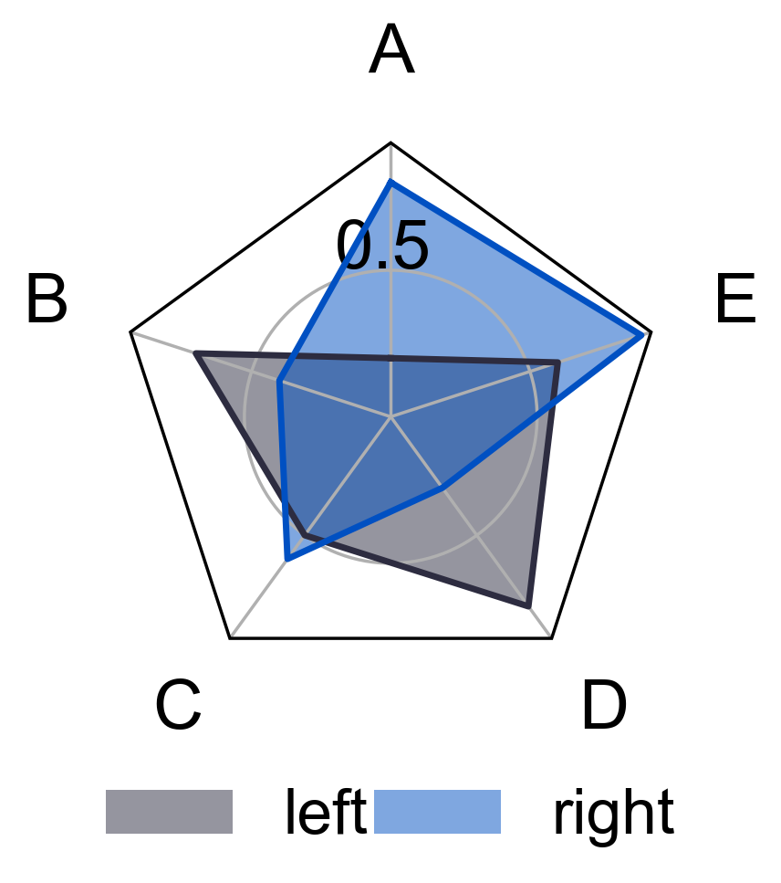

雷达图
======

雷达图由 `pre_radar` 注册投影, 再由 `pos_radar` 绘制数据。

.. code-block:: python

   import numpy as np
   from freeplot import FreePlot
   from freeplot.zoo import pos_radar, pre_radar

   labels = np.array(["A", "B", "C", "D", "E"])
   theta = pre_radar(len(labels), frame="polygon")
   data = {
       "left": np.array([0.2, 0.7, 0.5, 0.8, 0.6]),
       "right": np.array([0.8, 0.4, 0.6, 0.3, 0.9]),
   }

   fp = FreePlot(projection="radar")
   pos_radar(data, labels, fp, theta=theta)
   fp[0, 0].legend(loc="upper center", bbox_to_anchor=(0.5, -0.12), ncol=2, frameon=False)
   fp.savefig("radar.png")

