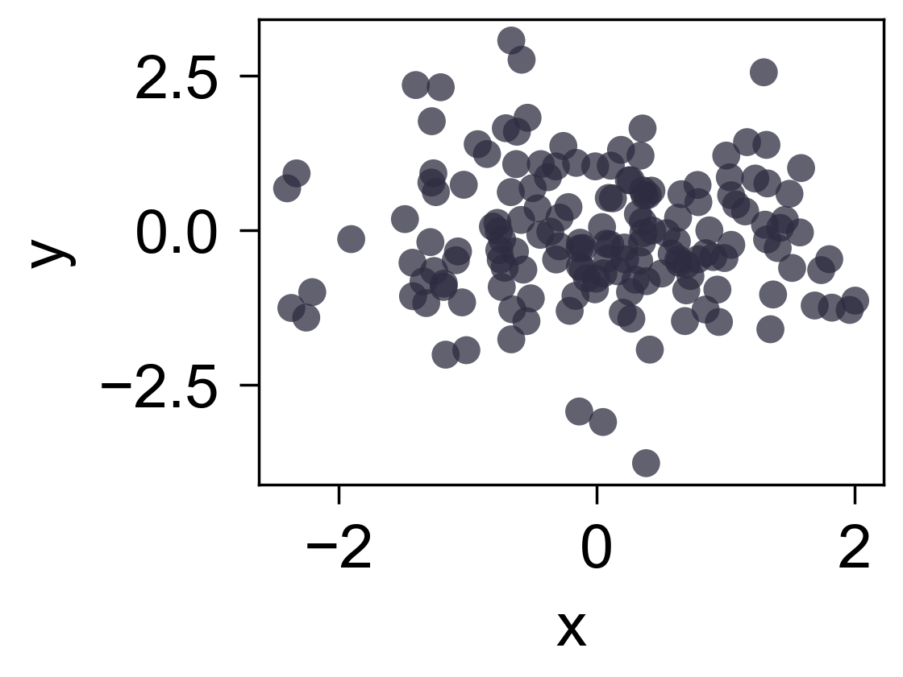

散点图
======

`scatterplot` 用于展示二维样本分布, 参数会透传给 Matplotlib `Axes.scatter`。

.. code-block:: python

   import numpy as np
   from freeplot import FreePlot

   rng = np.random.default_rng(0)
   fp = FreePlot()
   fp.scatterplot(rng.normal(size=160), rng.normal(size=160), edgecolors="none", alpha=0.75)
   fp.set_label("x", axis="x")
   fp.set_label("y", axis="y")
   fp.savefig("scatter.png")

