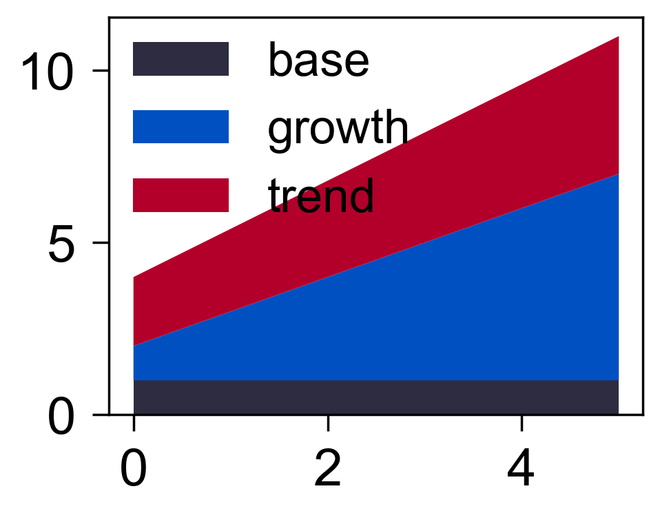

堆叠面积图
==========

`stackplot` 用于展示多组数值的累积变化。

.. code-block:: python

   import numpy as np
   from freeplot import FreePlot

   x = np.arange(6)
   y = np.vstack([np.ones(6), np.arange(1, 7), np.linspace(2, 4, 6)])

   fp = FreePlot()
   fp.stackplot(x, y, labels=["base", "growth", "trend"])
   fp[0, 0].legend()
   fp.savefig("stack.png")

