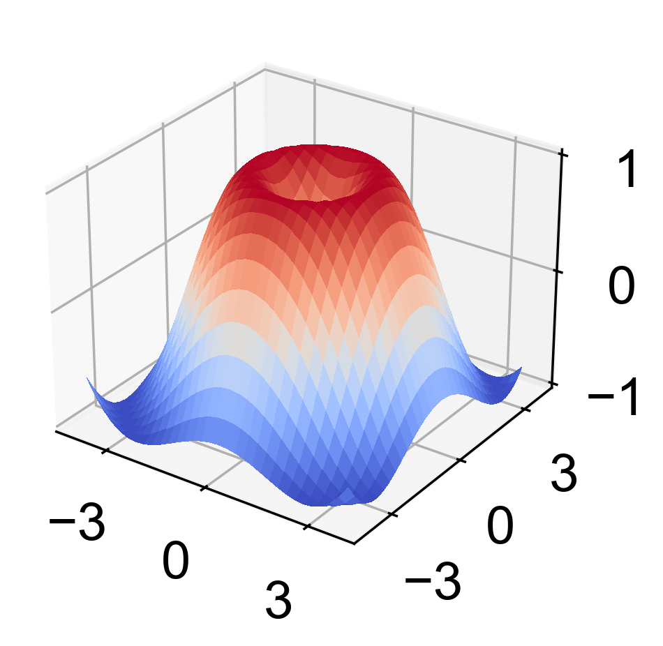

3D 曲面图
=========

`surfaceplot` 用于在 3D 坐标系中绘制曲面。

.. code-block:: python

   import numpy as np
   from freeplot import FreePlot

   x = np.arange(-4, 4, 0.25)
   y = np.arange(-4, 4, 0.25)
   X, Y = np.meshgrid(x, y)
   Z = np.sin(np.sqrt(X**2 + Y**2))

   fp = FreePlot(figsize=(2.1, 2.1), projection="3d")
   fp.surfaceplot(X, Y, Z, linewidth=0)
   fp[0, 0].view_init(elev=28, azim=-55)
   fp[0, 0].set_xticks([-3, 0, 3])
   fp[0, 0].set_yticks([-3, 0, 3])
   fp[0, 0].set_zticks([-1, 0, 1])
   fp.savefig("surface.png")

