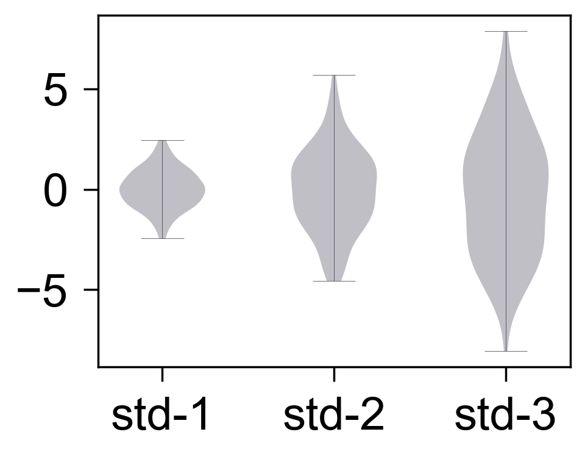

小提琴图
========

`violinplot` 用于比较多组数据分布。

.. code-block:: python

   import numpy as np
   from freeplot import FreePlot

   rng = np.random.default_rng(2)
   values = [rng.normal(0, std, 120) for std in (1, 2, 3)]

   fp = FreePlot()
   fp.violinplot(values, x=["std-1", "std-2", "std-3"])
   fp.savefig("violin.png")

